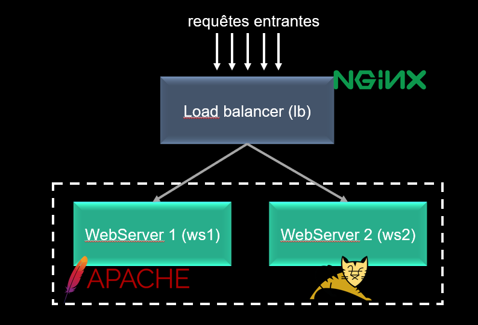
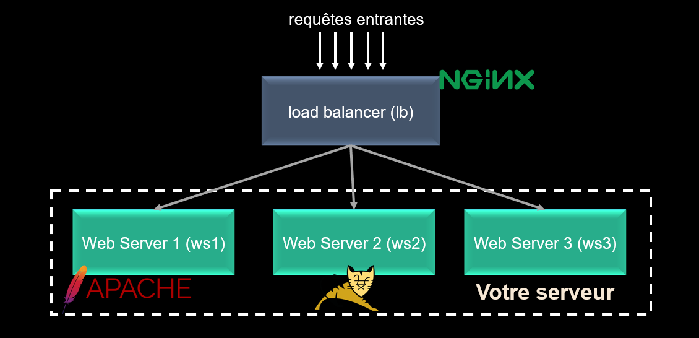

# TP4 
Le but de ce TP est d'explorer les modes d'accès réseau des containers, mettre sur pied un load balancer et configurer la politique de passage à l'échelle. 

## Mode d'accès réseau des containers 

Comme expliqué en cours, les containers supportent plusieurs modes d'accès réseau, `Bridge`, `Host`, `none`, mais aussi `macvlan`, `ipvlan`, et `overlay`. 
En vous appuyant sur votre compréhension des systèmes existants et de la , dresser un tableau comparatif où vous donner
les cas d'utilisations qui seraient compatible avec chaque mode d'accès réseau. 

## Choisir son mode d'accès réseau

Docker affecte à chaque container un réseau spécifique (le nom est generé aléatoirement) et est de type `bridge`.

Pour voir les différents réseaux existants : `docker network ls`.

Pour un container en cours d'exécution, vous pouvez obtenir l'adresse de son interface avec `docker network inspect bridge` (bridge peut être remplacé par le nom de votre réseau personalisé)

- Créer deux containers (node:12-alpine). Le premier container doit s'appeler `c1` et le deuxième `c2`. Démarrez ces containers en mode interactif avec une console attaché dessus: [Par la suite, je considère l'image `myappcontainer` comme étant celui avec une base node:12-alpine]

`docker run -dit --name c1 myappcontainer ash`

`docker run -dit --name c2 myappcontainer ash`

- Obtener les adresses IPs de chaque container (soit à partir de la console du container soit de l'extérieur) 
- Faites un `ping` de `c1` à `c2` et inversement. Que constatez-vous ? Noter la latence.
- Essayez de faire `ping c1` et `ping c2` dans c2 et c1 respectivement. Que constatez-vous ? 

Nous allons maintenant créer un réseau personnalisé `mynet`. 

- Créons le réseau `mybridge` de type `bridge` : `docker network create --driver bridge mynet`
- Démarrons à nouveau deux containers `c1` et `c2` en associant notre réseau `mynet` et un troisième container `c3` : 

```
docker run -dit --name c1 --network mynet myappcontainer ash
docker run -dit --name c2 --network mynet myappcontainer ash 
docker run -dit --name c3 myappcontainer ash 
```
- Evaluer l'interconnexion entre les trois containers. Qu'observez-vous ? 

## Implémentation d'un load balancer

Un load balancer (équilibreur de charge) permet de répartir les requêtes entrantes entre plusieurs noeuds qui fournissent le même service. 
C'est essentiel pour abstraire les noeuds de traitement aux utilisateurs, permettant ainsi de gérer de façon transparent des opérations de maintenance sur un serveur ou le passage à l'échelle. 
Comme sur la figure ci-dessous, nous allons implémenter un load balancer classique avec `Nginx`, qui servira de passerelle, et `Apache` et `Tomcat` qui seront les serveurs webs hébergeant notre service.



- Créer l'image pour le service Apache : 

```
FROM httpd:2.4
EXPOSE 80
```

- Créer l'image pour le service Tomcat : 

```
FROM nhive/ubuntu-16.04
RUN apt-get update
RUN apt-get install –y tomcat8
COPY launch-tomcat.sh /
CMD /launch-tomcat.sh
EXPOSE 8080
```

Le fichier `launch-tomcat.sh` est le script qui déclence l'exécution de Tomcat. Son contenu est le suivant : 

```
#!/bin/bash
/etc/init.d/tomcat8 start
sleep infinity
```

- Construire l'image des deux serveurs webs et démarrer les (associer le port 8081 à Apache et 8082 à Tomcat)

```
docker build -t apache2:v1 .
docker build -t tomcat:v1 . 
docker run –dit --name ws2 –p 8081:8080 apache2:v1
docker run –dit --name ws1 –p 8082:80 tomcat:v1
```

- Maintenant, nous allons créer le load balancer. Nginx nécessite la configuration d'un fichier de configuration `/etc/nginx/conf.d/default.conf`. 
Créer un fichier `nginx.conf` et mettez le contenu suivant : 
```
upstream loadbalancer{
server 172.17.0.1:8081 weight=5;
server 172.17.0.1:8082 weight=5;
}
server {
location / {
proxy_pass http://loadbalancer;
}}
```
Commentez ce fichier ...

L'image docker du container est : 

```
FROM nginx
RUN rm /etc/nginx/conf.d/default.conf
COPY nginx.conf /etc/nginx/conf.d/default.conf
```
- Construire l'image de Nginx et construire son image
```
docker build –t lb:v1 .
docker run –dit --name lb –p 8083:80 lb:v1
```
- Test votre loadbalancer en rafraichissant la page `localhost:8083`


## Réalisez le votre et soyez portable.

Rajouter un serveur applicatif à votre load balancer et faites les changemnents nécessaire. 



Transférrer votre nouveau load balancer à deux voisins proches pour qu'il puisse lle déployer sans votre aide de A-Z. 
Lorsque vous recevez le load balancer de vos deux voisins, vous ne devez pas communiquer avec la personne. 

`Dans un rapport, noter les difficultés que vous avez eu, le temps de déploiement, et si vous avez réussi à faire fonctionner.`

