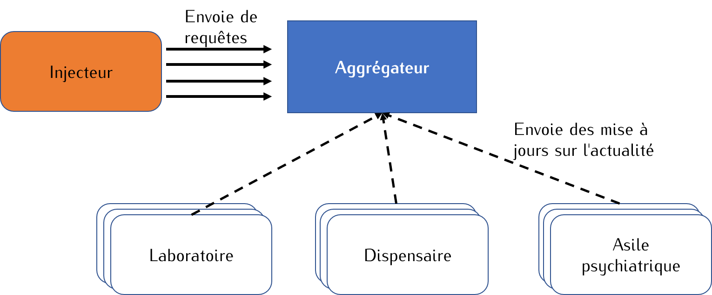

# Examen Cloud

## Règles + déroulement

L'examen a une durée de 3h (9h-12h) de temps où on attends de vous 25mn sur une partie théorique et 2h35 sur une partie pratique.

L'examen théorique comporte 20 questions à réponse dans un temps de 30mns. 
Pour les QCMs, une mauvaise réponse retire `-0.5pt` et une réponse vide `0pt`.

La partie pratique est composé d'une mise en situation où on attends de vous les scripts de déploiement couplés aux différents livrables des questions. Les livrables doivent être envoyés au plus tard à 12h15. Passé ce delai, votre note sera automatiquement 0 pour la partie pratique.
La partie théorique représente `40%` de la note finale et `60%` pour la partie théorique.

## Partie théorique

Pour accéder à la partie théorique, cliquez sur le lien `https://test.gclocked.com/?form=-NXRvImSddk-4rtcwKUd` et entrer votre adresse e-mail universitaire. 
`N'hésitez pas à changer de machine si le lien ne s'ouvre pas correctement sur votre machine actuelle`.
Automatiquement un minuteur se déclenche pour que vous puissiez répondre à vos questions.
Noter que vous n'aurez pas la possibilité de modifier vos réponses après avoir soumis vos réponses. 
Si vous démarrez la partie théorique et que le minuteur s'achève sans que vous n'ayez soumis vos réponses, vous aurez automatiquement `0`.

## Partie pratique 

On vous charge de réaliser un aggrégateur pour les centres hospitaliers.
Trois catégories de centres hospitaliers: un laboratoire, un dispensaire, et un asile psychiatrique.

Un laboratoire est charactérisé par un nom et les différentes analyses qu'ils éffectuent. 

Un dispensaire est charactérisé par un nom, un ensemble d'interventions qu'ils peuvent réaliser, et un certain nombre de lits.

Chaque hopital doit régulièrement informer le centre d'aggrégation de l'actualité du site. Concrètement, chaque hopital envoie ses informations, une mise à jour sur le nombre de patients traités et ceux qui passent la nuit à l'hopital (pour le dispensaire et le laboratoire).

`Je vous conseille de démarrer la partie 6 en parallèle`. 

1. Implémenter un container pour chaque catégorie d'hopital comme des serveur webs (avec l'outil/langage de votre choix). Concrètement, lorsqu'on intérroge les service web associé, ils retournent une page web conternant les informations géneré par chaque service. Les informations du containers sont générés entièrement aléatoirement. 

2. Implémenter un container pour l'aggrégateur qui correspondant à un serveur web qui recoit les informations des autres containers (hopitaux), et affiche sur une page web qui résume les informations de chaque hopital (comme détaillé précedemment). Les hopitaux doivent actualiser leur informations chaque 100ms et les expédier à l'aggrégateur. L'aggrégateur actualise ses informations sur la page web chaque 500ms. Malgré que les données de l'hopital sont generés aléatoirement, il faut assurer une certaine cohérence entre les mise à jours envoyés à l'aggrégateur. Par exemple, le nombre de patients traités ne devrait pas diminuer au fur à mesure. 

3. Tester votre architecture en lancant 1 aggrégateur, 5 dispensaires, 6 asiles psychiatriques, et 2 laboratoire. Faîtes une capture d'écran de l'exécution des montrant les résultats de l'aggrégateur.

4. Ecrire un injecteur de charge qui intérroge chaque `100ms` votre aggrégateur et qui enregistre la latence de traitement de la réquête.
Chaque `1s`, l'injecteur affichera dans la console une figure montrant la latence moyenne, 95ème et 99ème percentiles.

5. Tester votre injecteur sur `5mins` et capturez vos résultats.

6. Démarrer une autre machine virtuelle où vous installez Xen et où vous lancez une machine virtuelle. Déployez votre injecteur dans la machine virtuelle Xen (les containers restent sur la machine virtuelle précedente).
Collecter les résultats de votre injecteur sur `5mins` et comparer vos résultats avec ceux obtenu à la question 5.

Vous enverrez par mail ou via un git, vos codes sources et scripts/commandes utilisés pour lancer et configurer containers/VMs + une capture d'écran de l'exécution de votre injecteur qui affiche les courbes et les tables dans chaque contexte.
